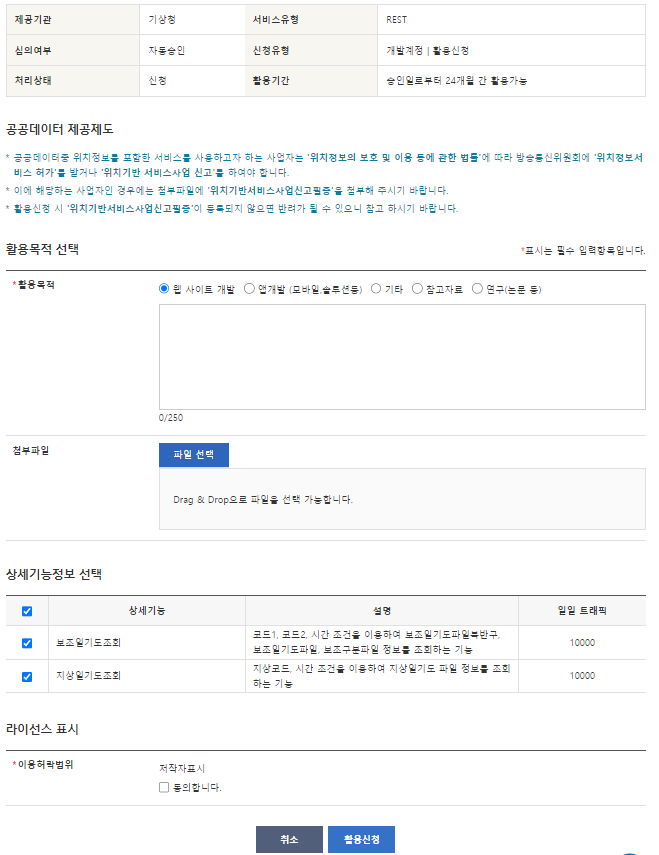

# Power BI REST api 데이터 가져오기

### 개요

[API 인증키/URL 생성](https://www.notion.so/Power-BI-REST-api-72d3317959c74474bfb906a7095d7846?pvs=21)

[powerbi, R라이브러리 활용](https://www.notion.so/Power-BI-REST-api-72d3317959c74474bfb906a7095d7846?pvs=21)

[주의점, 참고](https://www.notion.so/Power-BI-REST-api-72d3317959c74474bfb906a7095d7846?pvs=21)

### API 인증키/URL 생성

무료, API 인증키 발급까지 시간이 좀 소요될 수 있다. JSON, XML 형태 웹 URL 제공

- 국내 데이터 수집 : 국가 기관 및 민간 기업 등 다양
    
    [공공데이터 포털](https://www.data.go.kr/)
    
    공공데이터 포털 사이트 가입 후 원하는 서비스 검색 > 활용 신청
    
    - 활용 목적 및 저작자 표시, 활용 기간 확인
        
        
        
    
    api 키 생성 및 url 형태로 api 접근 가능
    매뉴얼에서 URL주소 변수 확인 후 URL주소 변경 후 데이터 접근
    
    `예시` 기상청 데이터 XML
    
    [http://apis.data.go.kr/1360000/AsosDalyInfoService/getWthrDataList?serviceKey=zFPni23SNqBcj%2FDT2uy94UQzs6xqqgC3wswTRrHh5YaNUEJsrt1P6MEp9AcGuRZNcUtdWMYRLS8y0Q00sI5oOg%3D%3D&numOfRows=500&pageNo=1&dataCd=ASOS&dateCd=DAY&startDt= 시작일 &endDt= 종료일 &stnIds= 지역](http://apis.data.go.kr/1360000/AsosDalyInfoService/getWthrDataList?serviceKey=zFPni23SNqBcj%2FDT2uy94UQzs6xqqgC3wswTRrHh5YaNUEJsrt1P6MEp9AcGuRZNcUtdWMYRLS8y0Q00sI5oOg%3D%3D&numOfRows=500&pageNo=1&dataCd=ASOS&dateCd=DAY&startDt=20230101&endDt=20230102&stnIds=108)
    

- 통계 데이터 수집 : 통계청 데이터
    
    [KOSIS 공유서비스](https://kosis.kr/openapi/index/index.jsp)
    
    가입 후 개발가이드 통계 목록(OR통계청)에서 원하는 통계지표 검색 > 통계자료 URL 신청
    
    - 결과값보기에서 기관코드 통계표ID 확인
        
        
        
    - 통계자료 > URL 생성에서 기관 및 통계표ID 검색 하여 선택
        
        
        
    
    조건 선택 후 URL 생성 > api 키 생성 및 url 형태로 api 접근 가능
    
    `예시` 소비자물가지수 JSON
    
    [https://kosis.kr/openapi/Param/statisticsParameterData.do?method=getList&apiKey=YTI0OTg5OTJjODIwOTBkM2M5ZjhiNTU0MjBhNzc0OTA=&itmId=T+&objL1=T10&objL2=&objL3=&objL4=&objL5=&objL6=&objL7=&objL8=&format=json&jsonVD=Y&prdSe=M&startPrdDe=시작년월&endPrdDe=마지막년월&orgId=기관&tblId=통계청ID](https://kosis.kr/openapi/Param/statisticsParameterData.do?method=getList&apiKey=YTI0OTg5OTJjODIwOTBkM2M5ZjhiNTU0MjBhNzc0OTA=&itmId=T+&objL1=T10&objL2=&objL3=&objL4=&objL5=&objL6=&objL7=&objL8=&format=json&jsonVD=Y&prdSe=M&startPrdDe=202001&endPrdDe=202212&orgId=101&tblId=DT_1J20003)
    

### Power BI 활용

데이터 가져오기 웹 선택 후 생성한 URL 입력


- XML 형식
    
    컬럼이 테이블 형식으로 조회 되기 때문에 정상적으로 보일 때까지 테이블 컬럼은 확장 후 사용
    
    
    
    
    

- JSON 형식
    
    WEB 불러오기를 통한 JSON에서 테이블 형태로 변환이 안됨, power query m langauge 수정, Json.Document 함수를 사용
    
    파워쿼리 고급 편집기 > let 첫행 원본 함수를 Json.Document(Web.Contents(”주소”)) 이와 같이 변경
    
    `예시`power query 문
    
    ```jsx
    let
    	원본 = Json.Document(Web.Contents("[https://kosis.kr/openapi/Param/statisticsParameterData.do?method=getList&apiKey=YTI0OTg5OTJjODIwOTBkM2M5ZjhiNTU0MjBhNzc0OTA=&itmId=T+&objL1=T10&objL2=&objL3=&objL4=&objL5=&objL6=&objL7=&objL8=&format=json&jsonVD=Y&prdSe=M&startPrdDe=202001&endPrdDe=202212&orgId=101&tblId=DT_1J20003](https://kosis.kr/openapi/Param/statisticsParameterData.do?method=getList&apiKey=YTI0OTg5OTJjODIwOTBkM2M5ZjhiNTU0MjBhNzc0OTA=&itmId=T+&objL1=T10&objL2=&objL3=&objL4=&objL5=&objL6=&objL7=&objL8=&format=json&jsonVD=Y&prdSe=M&startPrdDe=202001&endPrdDe=202212&orgId=101&tblId=DT_1J20003)")),
    	#"테이블로 변환됨" = Table.FromList(원본, Splitter.SplitByNothing(), null, null, ExtraValues.Error),
    	#"확장된 Column1" = Table.ExpandRecordColumn(#"테이블로 변환됨", "Column1", {"TBL_NM", "PRD_DE", "TBL_ID", "ITM_NM", "ITM_NM_ENG", "ITM_ID", "UNIT_NM", "ORG_ID", "UNIT_NM_ENG", "C1_OBJ_NM", "C1_OBJ_NM_ENG", "DT", "PRD_SE", "C1", "C1_NM", "C1_NM_ENG"}, {"Column1.TBL_NM", "Column1.PRD_DE", "Column1.TBL_ID", "Column1.ITM_NM", "Column1.ITM_NM_ENG", "Column1.ITM_ID", "Column1.UNIT_NM", "Column1.ORG_ID", "Column1.UNIT_NM_ENG", "Column1.C1_OBJ_NM", "Column1.C1_OBJ_NM_ENG", "Column1.DT", "Column1.PRD_SE", "Column1.C1", "Column1.C1_NM", "Column1.C1_NM_ENG"}),
    	#"제거된 열 수" = Table.RemoveColumns(#"확장된 Column1",{"Column1.PRD_SE", "Column1.C1", "Column1.C1_NM", "Column1.C1_NM_ENG", "Column1.ITM_ID", "Column1.UNIT_NM", "Column1.ORG_ID", "Column1.UNIT_NM_ENG", "Column1.C1_OBJ_NM", "Column1.C1_OBJ_NM_ENG", "Column1.TBL_ID", "Column1.TBL_NM"}),
    	#"변경된 유형" = Table.TransformColumnTypes(#"제거된 열 수",{{"Column1.DT", type number}, {"Column1.PRD_DE", type text}}),
    	#"추가된 인덱스" = Table.AddIndexColumn(#"변경된 유형", "인덱스", 1, 1, Int64.Type),
    	#"다시 정렬한 열 수" = Table.ReorderColumns(#"추가된 인덱스",{"인덱스", "Column1.PRD_DE", "Column1.ITM_NM", "Column1.ITM_NM_ENG", "Column1.DT"})
    in
    	#"다시 정렬한 열 수"
    ```
    
    `소비자물가지수`  완료 테이블
    
    
    

### R 파이썬 라이브러리 사용

xml 형식 R

- xml2 read_xml 함수 활용
    
    ```jsx
    library(tidyverse)
    library(xml2)
    
    #기상청데이터
    
    mindate = "20200101"
    maxdate = "20221231"
    place <- c(90,93,95,98,99,100,101,102,104,105,106,108,112,114,115,119,121,127,129,130,131,133,135,136,137,138,140,143,146,152,155,156,159,162,165,168,169,170,172,174,177,184,185,188,189,192,201,202,203,211,212,216,217,221,226,232,235,236,238,239,243,244,245,247,248,251,252,253,254,255,257,258,259,260,261,262,263,264,266,268,271,272,273,276,277,
    278,279,281,283,284,285,288,289,294,295)
    
    api <- paste0("http://apis.data.go.kr/1360000/AsosDalyInfoService/getWthrDataList?serviceKey={KOSIS_TOKEN}&numOfRows=500&pageNo=1&dataCd=ASOS&dateCd=DAY&startDt=",mindate,"&endDt=",maxdate,"&stnIds=",as.character(place[1]))
    
    api -> read_xml(api) %>% 
          as_list() %>% 
          as_tibble() %>% 
          unnest_longer(response) %>% 
          filter(response_id == 'items') %>% 
          unnest(response) %>% 
          unnest_wider(response) %>% 
          unnest(everything()) %>% 
          unnest(everything())
    ```
    

json 형식 R

- kosis 펌
    
    ```jsx
    library(httr)
    library(rvest)
    library(jsonlite)
    library(ggplot2)
    
    rm(list = ls()) # 모든변수 초기화
    
    # 환경변수에 사용자 key 정의 (환경변수 편집 usethis::edit_r_environ() )
    # KOSIS_TOKEN = ZjZjOTI3MjRjNmU1YzdhZTMwOWRjNjgxN2MzNDgwNmY=
    v_apiKey = Sys.getenv('KOSIS_TOKEN')
    baseurl <- 'https://kosis.kr/openapi/statisticsData.do' # 요청URL
    
    url_page <-
      GET(
        url = baseurl,
        query = list(
          method = 'getList',
          format = 'json',
          jsonVD = 'Y',
          apiKey = v_apiKey %>% I(),
          userStatsId = 'openapisample/101/DT_1IN1502/2/1/20191106094026_1', # 시계열 조회 키캆
          prdSe = 'Y',
          newEstPrdCnt = 3, # 최근수록시점 개수
          prdInterval = 1   # 수록시점 간격
        )
      )
    
    url_page %>% content(as = 'text', encoding = 'UTF-8') %>% fromJSON() -> json
    
    df_lists <-
      data.frame(
        C1_NM = c(json$C1_NM),
        ITM_NM = c(json$ITM_NM),
        prd_de = c(json$PRD_DE),
        dt = c(json$DT)
      )
    
    ```
    

json 형식 파이썬

- kosis 펌
    
    ```jsx
    import json
    # python 3.x 버전에서 사용 (2.x 버전이라면 from urllib import urlopen)
    from urllib.request import urlopen
    
    import matplotlib.pyplot as plt
    
    # 한글 폰트 사용을 위해서 세팅
    from matplotlib import font_manager, rc
    font_path = "C:/Windows/Fonts/malgun.ttf"
    font = font_manager.FontProperties(fname=font_path).get_name()
    rc('font', family=font)
    
    #url을 통해 json 데이터 가져오기
    with urlopen("https://kosis.kr/openapi/statisticsData.do?method=getList&apiKey=ZjZjOTI3MjRjNmU1YzdhZTMwOWRjNjgxN2MzNDgwNmY=&format=json&jsonVD=Y&userStatsId=openapisample/101/DT_1IN1502/2/1/20191106094026_1&prdSe=Y&newEstPrdCnt=3") as url:
        json_file = url.read()
    
    py_json = json.loads(json_file.decode('utf-8'))
    
    ```
    

### 참고, 주의점

必출처 표기 및 사용 기간 확인

POWER QUERY를 FOR 루프 처럼 사용하기 > 사용자 지정 함수 활용

기상청과 같이 각 지방 별 기상청 데이터를 연속으로 불러오는 경우, 지역 코드를 변수로 하여 연속으로 불러옴

- `준비`
    
    1.power bi에 기상청 api를 웹url 불러오기 → table1 저장
    
    2.지역코드 및 시작일, 종료일 테이블 생성 후 power bi에 불러오기 → table2 저장
    
    - table2 아래와 같이 미리 생성 해야 됨
        
        
        

- `table1`
    
    table1 > url 주소에 지역코드 시작일 종료일이 입력되어 있음
    
    ```jsx
    
    let
    	원본 = Xml.Tables(Web.Contents("http://apis.data.go.kr/1360000/AsosDalyInfoService/getWthrDataList?serviceKey=zFPni23SNqBcj%2FDT2uy94UQzs6xqqgC3wswTRrHh5YaNUEJsrt1P6MEp9AcGuRZNcUtdWMYRLS8y0Q00sI5oOg%3D%3D&numOfRows=500&pageNo=1&dataCd=ASOS&dateCd=DAY&startDt=20220101&endDt=20220102&stnIds=108")),
    	Table1 = 원본{1}[Table]
    in
    	Table1
    ```
    
    table1 > 아래와 같이 변경, 지역 시작일 종료일을 변수로 선언하고 url 주소 변경
    
    ```jsx
    (지역 as text, mindate as text, maxdate as text) =>
    
    let
    	원본 = Xml.Tables(Web.Contents("http://apis.data.go.kr/1360000/AsosDalyInfoService/getWthrDataList?serviceKey=zFPni23SNqBcj%2FDT2uy94UQzs6xqqgC3wswTRrHh5YaNUEJsrt1P6MEp9AcGuRZNcUtdWMYRLS8y0Q00sI5oOg%3D%3D&numOfRows=500&pageNo=1&dataCd=ASOS&dateCd=DAY&startDt="& mindate &"&endDt="& maxdate &"&stnIds="&지역)),
    	Table1 = 원본{1}[Table]
    in
    	Table1
    ```
    
    변경 후 power query 화면은 아래와 같이 변한다. 해당 매개 변수에 올바른 값을 입력하면 기존과 같이 조회 가능
    
    
    

- `table2`
    
    table2로 가서 열 추가 > 사용자 지정 함수 호출
    
    
    
    아래와 같이 변수에 넣을 값을 테이블로 선택,  table2의 각 컬럼이 table1에 변수 값에 들어가서 작동됨
    
    
    
    컬럼 생성 후 테이블로 되어 있어 필요한 컬럼으로 확장하여 사용
    
    
    

**>여러 기상청 값 조회 시 응답 지연 문제 발생 - api 제공처 문제로 발생됨, 다른 시간에 시도하거나 for 루프 횟수를 줄이는 방법으로 접근**

**통계청 open API 메뉴얼**

[](https://kosis.kr/openapi/file/openApi_manual_v1.0.pdf)